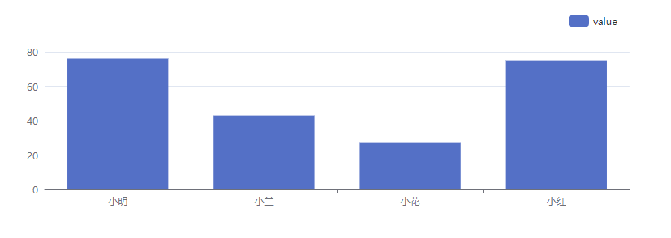

# 快速上手

## 依赖环境

因为该库是基于 echarts 来封装的，所以必须要依赖 echarts

> echarts

## 安装使用

步骤一：
下载 npm 包

```npm
npm install echarts
npm install echarts-package
```

步骤二：
引入安装插件

```js
import echartsView from "echarts-package";
Vue.use(echartsView);
```

步骤三：
在页面上使用组件，在 echarts-package 中默认接收以 `name` 和 `value` 命名的属性，以此来渲染页面，后端返回的数据源以参数的形式传入 `this.$eChartFn.handleData` 方法中处理，将并选择对应的 `template` 作为渲染模板，最后将方法返回的配置传入 `echartsView` 组件中，即可渲染数据。

```vue
<template>
  <div>
    <!-- 为 ECharts 传入数据源和定义 -->
    <echartsView :chart-option="chartOpt"></echartsView>
  </div>
</template>

<script>
export default {
  name: "App",
  data() {
    return {
      chartOpt: {},
    };
  },
  mounted() {
    // 准备好模拟后端返回的数据列表
    let data = [
      {
        name: "小兰",
        value: 76,
      },
      {
        name: "小绿",
        value: 43,
      },
      {
        name: "小红",
        value: 27,
      },
    ];
    // 使用内置的 handleData 方法处理数据
    this.chartOpt = this.$eChartFn.handleData({ template: "base", data });
  },
};
</script>
```

是的就是这么简单，只需要传入数据源和配置模板即可，效果如下所示


